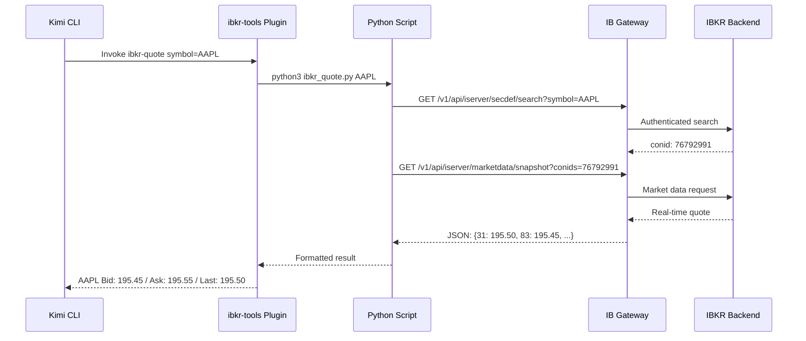

# IBKR Tools for Kimi — Local IB Gateway Plugin

Direct Interactive Brokers integration for Kimi Code CLI via your locally installed IB Gateway. No MCP server, no Node.js dependencies — just Python scripts talking directly to IB Gateway's REST API. Now with AI-powered technical analysis, ORB setup grading, and pre-market briefing generation.

## What You Get

| Component | Description |
|-----------|-------------|
| **ibkr-tools** (Plugin) | 16 Python trading tools callable from Kimi CLI |
| **ibkr-trading** (Skill) | Trading workflows, risk rules, troubleshooting guide |
| **ibkr_core.py** | Shared API client for IB Gateway |

## Architecture

```mermaid
flowchart LR
    A[Kimi Code CLI] -->|1. Discovers Plugin| B[ibkr-tools<br/>kimi.plugin.json]
    B -->|2. Invokes Tool| C[Python Script]
    C -->|3. HTTPS localhost:4004| D[Your IB Gateway]
    D -->|4. Authenticated API| E[IBKR Servers]
    E -->|5. Market Data / Order Fill| D
    D -->|6. JSON Response| C
    C -->|7. Formatted Result| B
    B -->|8. Display| A

    F[ibkr-trading<br/>SKILL.md] -.->|Workflow Knowledge| A

    style A fill:#4CAF50,color:#fff
    style B fill:#2196F3,color:#fff
    style D fill:#FF9800,color:#000
    style F fill:#9C27B0,color:#fff
```



## Prerequisites

- [ ] Interactive Brokers account (paper or live)
- [ ] IB Gateway installed and running locally
- [ ] Python 3.8+
- [ ] Kimi Code CLI installed
- [ ] Market data subscriptions active (for quotes)

## Directory Structure

```
ibkr-kimi-plugin/
├── README.md                          # This file
├── ibkr-tools/
│   ├── kimi.plugin.json               # Plugin manifest (tools definition)
│   └── scripts/
│       ├── ibkr_core.py               # Shared API client
│       ├── ibkr_status.py             # Check Gateway connection
│       ├── ibkr_quote.py              # Real-time quotes
│       ├── ibkr_search.py             # Contract lookup by symbol
│       ├── ibkr_positions.py          # Portfolio positions
│       ├── ibkr_account.py            # Account balances
│       ├── ibkr_orders.py             # List open orders
│       ├── ibkr_order.py              # Place orders
│       ├── ibkr_cancel_order.py       # Cancel orders
│       ├── ibkr_history.py            # Historical bar data
│       ├── ibkr_pnl.py                # P&L summary
│       ├── ibkr_gap_scan.py           # Pre-market gap-up/down scanner
│       ├── ibkr_market_movers.py      # Market gainers/losers/most active
│       ├── ibkr_analyze_technical.py  # Technical analysis (RSI, SMA, ATR, MACD, BB)
│       ├── ibkr_analyze_setup.py      # ORB setup evaluator (grades A-F)
│       ├── ibkr_analyze_finnhub.py    # News, earnings, sentiment, analysts
│       └── ibkr_briefing.py           # Full pre-market briefing generator
└── ibkr-trading/
    └── SKILL.md                       # Trading workflows & risk rules
```

## Quick Start

### 1. Install the Plugin

```bash
# Install from this directory
kimi plugin install ./ibkr-tools

# Or install from Git repository
kimi plugin install https://github.com/youruser/ibkr-kimi-plugin.git
```

### 2. Verify IB Gateway is Running

Inside Kimi CLI:
```
ibkr-status
```

Expected output:
```json
{
  "status": "CONNECTED",
  "connected": true,
  "mode": "PAPER",
  "endpoint": "https://localhost:4004/v1/api",
  "accounts": ["DU1234567"],
  "account_count": 1
}
```

### 3. Test Market Data

```
ibkr-quote symbol=AAPL
```

### 4. View Positions

```
ibkr-positions
```

### 5. Place a Paper Trade

```
ibkr-order symbol=AAPL action=BUY quantity=10 type=LMT price=195.50
```

### 6. Run Pre-Market Gap Scan

```
ibkr-gap-scan --min-gap 3 --direction up --min-price 10 --universe nasdaq100
```

### 7. Check Market Movers

```
ibkr-market-movers --type gainers --count 10 --session pre_market
```

## Available Tools

| Tool | Arguments | What It Does |
|------|-----------|--------------|
| `ibkr-status` | None | Check if IB Gateway is connected |
| `ibkr-quote` | `symbol` | Bid, ask, last, volume, change |
| `ibkr-search` | `symbol` | Find contract ID (conid) and details |
| `ibkr-positions` | None | All positions with P&L |
| `ibkr-account` | None | Net liquidation, buying power, cash |
| `ibkr-orders` | None | All open orders with status |
| `ibkr-order` | `symbol action quantity type [price]` | Place an order (paper by default) |
| `ibkr-cancel-order` | `order_id` | Cancel an open order |
| `ibkr-history` | `--start-date`, `--end-date`, `--bar-size`, `--format csv/json`, `--output` | OHLCV+ historical data download (default: last 3 months) |
| `ibkr-pnl` | None | Daily realized + unrealized P&L |
| `ibkr-gap-scan` | See parameter guide below | Pre-market gap-up/down scanner |
| `ibkr-market-movers` | See parameter guide below | Gainers, losers, most active |
| `ibkr-analyze-technical` | `--period 1m/3m/6m/1y`, `--bar-size 1d/1h`, `--detailed` | Full technical analysis with momentum score |
| `ibkr-analyze-setup` | `--direction long/short`, `--entry`, `--stop`, `--target` | ORB setup evaluator with A-F grade |
| `ibkr-analyze-finnhub` | `--news-count`, `--from-date` | News, earnings, sentiment (needs FINNHUB_API_KEY) |
| `ibkr-briefing` | `--universe`, `--gap-min`, `--max-setups` | Full pre-market briefing with setup ideas |

### Gap Scan Parameters

| Parameter | Type | Default | Description |
|-----------|------|---------|-------------|
| `--min-gap` | float | 2.0 | Minimum gap % to report |
| `--max-gap` | float | 50.0 | Maximum gap % to report |
| `--direction` | up/down/both | both | Gap direction filter |
| `--min-price` | float | 5.0 | Minimum stock price ($) |
| `--max-price` | float | 500.0 | Maximum stock price ($) |
| `--min-volume` | int | 100 | Min daily volume (thousands) |
| `--universe` | nasdaq100/sp500/most_active | most_active | Stock universe |
| `--max-results` | int | 50 | Max stocks to return |
| `--sort-by` | gap/volume/price | gap | Sort field |
| `--detailed` | flag | false | Include full quote details |

### Market Movers Parameters

| Parameter | Type | Default | Description |
|-----------|------|---------|-------------|
| `--type` | gainers/losers/most_active/all | all | Which movers to show |
| `--count` | int | 20 | Results per category |
| `--session` | pre_market/regular/after_hours | regular | Market session context |
| `--exchange` | nyse/nasdaq/all | all | Exchange filter |
| `--min-price` | float | 5.0 | Minimum stock price ($) |
| `--min-volume` | int | 50 | Min daily volume (thousands) |

## Configuration

### Environment Variables

Set these before starting Kimi, or configure in your shell profile:

```bash
export IB_GATEWAY_HOST=localhost        # IB Gateway hostname
export IB_GATEWAY_PORT=4004             # Your IB Gateway API port
export IB_PAPER_TRADING=true            # true = paper trading only
```

### IB Gateway Settings

1. Open IB Gateway → Edit → Settings → API
2. Enable "ActiveX and Socket Clients"
3. Note the port (default: 4001 for Gateway, 7496/7497 for TWS)
4. Check "Allow connections from localhost only"
5. **For Client Portal API**: Your Gateway port (default 4004) uses the web-based API settings

### Port Reference

| Platform | Default Port | Use Case |
|----------|-------------|----------|
| IB Gateway API | 4001 | Socket API (alternative) |
| TWS Paper | 7497 | With TWS GUI |
| TWS Live | 7496 | With TWS GUI |
| Client Portal (your Gateway) | 4004 | **This plugin uses this** |

## How It Works (Technical)

The plugin uses IBKR's **Client Portal API** — a REST API that runs through IB Gateway on `https://localhost:4004/v1/api`.



Key technical details:
- **No external dependencies** — pure Python standard library (`urllib`, `ssl`, `json`)
- **Self-signed SSL** — scripts disable cert verification for localhost (IB Gateway uses self-signed cert)
- **Auto-discovery** — `ibkr_core.py` handles Gateway detection, SSL context, and error formatting
- **Structured output** — all tools return JSON: `{"status": "OK", ...}` or `{"status": "ERROR", ...}`

## Safety Features

1. **Paper Trading Default**: `IB_PAPER_TRADING=true` must be explicitly set to `false` for live orders
2. **Preview Before Submit**: Orders are previewed via `whatif` endpoint to show margin impact
3. **No Credentials Stored**: Uses IB Gateway's existing session — no API keys in code
4. **Localhost Only**: Designed for local IB Gateway — never exposes credentials externally
5. **Order Confirmation**: Every order response includes mode (PAPER/LIVE) and order ID

## Extending

### Adding a New Tool

1. Create `scripts/ibkr_my_tool.py`:

```python
#!/usr/bin/env python3
import sys, os
sys.path.insert(0, os.path.dirname(os.path.abspath(__file__)))
from ibkr_core import api_get, print_json, check_gateway

def main():
    # Check gateway
    conn = check_gateway()
    if "_error" in conn:
        print_json({"status": "ERROR", "message": "Not connected"})
        sys.exit(1)

    # Your API call
    result = api_get("/your/endpoint")
    print_json({"status": "OK", "data": result})

if __name__ == "__main__":
    main()
```

2. Add to `kimi.plugin.json`:

```json
{
  "name": "ibkr-my-tool",
  "description": "What it does",
  "command": ["python3", "{plugin_dir}/scripts/ibkr_my_tool.py"]
}
```

3. Reinstall: `kimi plugin install ./ibkr-tools`

## Direct API Testing

Test without Kimi using curl:

```bash
# Check session
curl -k https://localhost:4004/v1/api/sso/validate

# Search AAPL
curl -k 'https://localhost:4004/v1/api/iserver/secdef/search?symbol=AAPL&secType=STK'

# Get quote (replace 76792991 with actual conid from search)
curl -k 'https://localhost:4004/v1/api/iserver/marketdata/snapshot?conids=76792991&fields=31,83,84'

# Get positions
curl -k https://localhost:4004/v1/api/portfolio/positions

# Get account summary
curl -k https://localhost:4004/v1/api/iserver/account/summary
```

## Troubleshooting

| Problem | Solution |
|---------|----------|
| "Connection failed" | Start IB Gateway, enable API, check port |
| "HTTP 401" | Session expired — re-login to IB Gateway |
| No market data | Subscribe to market data in IB Account Management |
| Empty positions | Normal if you hold no positions |
| Order rejected | Check buying power with `ibkr-account` |
| Plugin not found | Run `kimi plugin list` to verify installation |

## References

- [IBKR Client Portal API Reference](https://www.interactivebrokers.com/campus/ibkr-api-page/cpapi-v1/)
- [Kimi Code CLI Plugin Docs](https://moonshotai.github.io/kimi-cli/en/customization/plugins.html)
- [Kimi Code CLI Skill Docs](https://moonshotai.github.io/kimi-cli/en/customization/skills.html)
