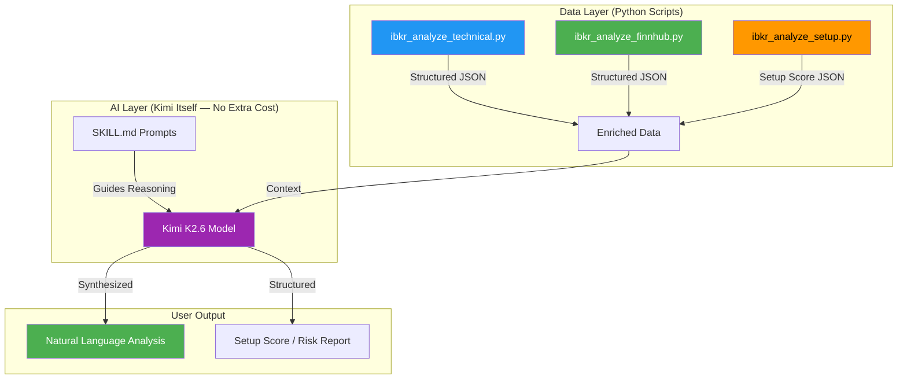
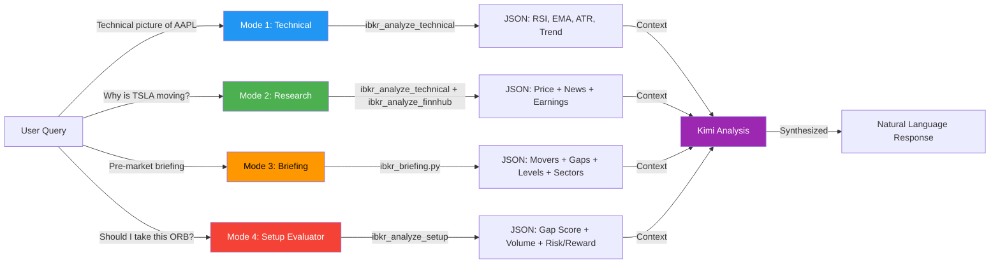
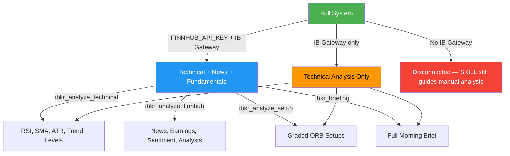

# Proposal: IBKR AI Analysis Module
## Research, Planning & Architecture for the Final Pre-Market Layer

**Version:** 1.0
**Date:** 2026-06-28
**Status:** Proposal — Awaiting Approval Before Build

---

## 1. Problem Statement

You have market data (quotes, positions, gap scans, movers). You have order execution. What is missing is **intelligence** — the ability to ask:

- "Why is TSLA gapping up 5% this morning?"
- "Should I take this ORB setup on NVDA?"
- "What is my portfolio's risk exposure right now?"
- "Give me a pre-market briefing with the best setups today"

This proposal defines the architecture, data sources, and implementation plan for an AI analysis layer that sits on top of the existing `ibkr-tools` plugin.

---

## 2. Core Insight: Kimi IS the AI

The most important finding from research: **we do not need to call an external LLM**. Kimi Code CLI is already powered by Kimi K2.6 (1T parameter MoE model). The architecture should leverage Kimi's native intelligence, not duplicate it.



**Separation of concerns:**
- **Scripts** fetch and calculate (what computers do best)
- **Kimi** reasons and synthesizes (what AI does best)
- **Skill** guides the reasoning (what domain expertise provides)

---

## 3. Research Findings

### 3.1 What IB Gateway Already Provides (Free)

The Client Portal API has pre-computed fields we were not using:

| Field Code | Data | Use For |
|------------|------|---------|
| `7676` | EMA(50) | Trend direction |
| `7677` | EMA(20) | Short-term momentum |
| `7678` | Price/EMA(200) ratio | Long-term trend strength |
| `7679` | Price/EMA(100) ratio | Medium-term positioning |
| `7724` | Price/EMA(50) ratio | Mean reversion signals |
| `7681` | Price/EMA(20) ratio | Short-term overbought/oversold |
| `7682` | Change Since Open | Intraday momentum |
| `7683-7690` | Upcoming Earnings/Events | Catalyst identification (requires WSH sub) |
| `7920` | Daily PnL (real-time) | Live position tracking |
| `7762` | High-precision volume | Volume analysis |

**Implication:** We can get EMA-based trend analysis directly from IB Gateway without calculating anything. Our scripts should request these fields.

### 3.2 Kimi Code CLI Capabilities

From official documentation:

| Capability | How We Use It |
|------------|---------------|
| **Web search** | Kimi can search the web for news about a ticker during analysis |
| **Web page fetch** | Kimi can read earnings reports, SEC filings, news articles |
| **Subagents** | Can dispatch parallel research tasks |
| **256K context** | Can hold entire gap scan + historical data + news in context |
| **Tool calls** | Can invoke our plugin tools and receive structured JSON |

**Implication:** For "Why is TSLA moving?" — Kimi can search the web and read news articles itself. We only need to provide the price/action context from IBKR.

### 3.3 Finnhub Free Tier

For programmatic news/fundamentals access within our Python scripts:

| Feature | Free Tier Limit | Relevance |
|---------|----------------|-----------|
| Company news | 1 year + real-time, 60 calls/min | "Why is this moving?" |
| Earnings calendar | 1 month + real-time | Catalyst timing |
| EPS surprises | 4 quarters | Beat/miss analysis |
| Recommendation trends | Full history | Analyst sentiment |
| Price targets | Full history | Upside/downside estimate |
| Company profile | Full | Sector, market cap, peers |
| **API Key required?** | **Yes** (free signup) | One-time setup |

**Implication:** Optional but valuable. User provides `FINNHUB_API_KEY` as env var. Without it, technical analysis still works fully.

---

## 4. Proposed Architecture

### 4.1 Three Analysis Modes



### 4.2 Script Specifications

#### Script 1: `ibkr_analyze_technical.py`

**Purpose:** Pure price-action technical analysis using IB Gateway data + Python math.

**No external API required.**

```
Input:  symbol, [lookback_period=3m], [timeframe=1d]
Output: {
  "symbol": "TSLA",
  "price": 242.50,
  "indicators": {
    "rsi_14": 68.5,
    "sma_20": 238.40,
    "sma_50": 230.10,
    "sma_200": 215.80,
    "ema_20": 239.20,        // from IB Gateway field 7677
    "ema_50": 232.50,        // from IB Gateway field 7676
    "atr_14": 8.35,
    "atr_pct": 3.44,
    "bb_upper": 250.30,
    "bb_lower": 226.50,
    "bb_position": 0.65,     // 0=lower, 1=upper
    "macd": 1.25,
    "macd_signal": 0.80,
    "macd_histogram": 0.45,
    "volume_sma_20": 45000000,
    "volume_ratio": 1.35     // today's vol / avg
  },
  "trend": {
    "direction": "bullish",
    "strength": 0.72,        // 0-1 score
    "above_sma20": true,
    "above_sma50": true,
    "above_sma200": true,
    "golden_cross": false,   // SMA20 > SMA50 recently
    "death_cross": false
  },
  "levels": {
    "support": [238.00, 230.50, 220.00],
    "resistance": [248.00, 255.00, 265.00],
    "pivot": 242.00
  },
  "momentum": {
    "score": 65,             // 0-100 composite
    "regime": "accumulating" // distributing|accumulating|neutral
  }
}
```

**Implementation:**
- Fetch historical bars from IB Gateway (`/iserver/marketdata/history`)
- Calculate RSI, SMA, ATR, Bollinger Bands, MACD in pure Python (no dependencies)
- Fetch EMA(20/50) from IB Gateway market data snapshot (field codes 7676/7677)
- Detect support/resistance from recent swing highs/lows
- Compute composite momentum score (0-100)

#### Script 2: `ibkr_analyze_finnhub.py`

**Purpose:** News, earnings, and sentiment enrichment.

**Requires `FINNHUB_API_KEY` environment variable.** Gracefully degrades without it.

```
Input:  symbol
Output: {
  "symbol": "TSLA",
  "company": {
    "name": "Tesla Inc",
    "sector": "Consumer Cyclical",
    "industry": "Auto Manufacturers",
    "market_cap": 780000000000,
    "employees": 140473
  },
  "news": [
    {
      "headline": "Tesla deliveries beat estimates in Q2",
      "source": "Reuters",
      "datetime": "2026-06-28T08:30:00Z",
      "sentiment": "positive",     // computed from headline keywords
      "url": "..."
    }
  ],
  "sentiment": {
    "overall": "bullish",          // bullish|bearish|neutral
    "news_score": 0.65,            // -1 to 1
    "bullish_count": 8,
    "bearish_count": 3
  },
  "earnings": {
    "next_date": "2026-07-22",
    "eps_surprise_last": 0.15,     // beat by $0.15
    "eps_surprise_pct": 12.5,
    "days_to_earnings": 24
  },
  "analysts": {
    "recommendation": "buy",       // strong_buy|buy|hold|sell|strong_sell
    "target_price": 280.00,
    "current_price": 242.50,
    "upside_pct": 15.5
  }
}
```

**Implementation:**
- Call Finnhub REST API (pure Python `urllib` — no extra dependencies)
- Parse news headlines for sentiment keywords (rule-based, no NLP library needed)
- Aggregate analyst recommendations
- Return empty/graceful response if no API key or rate limit hit

#### Script 3: `ibkr_analyze_setup.py`

**Purpose:** ORB-specific setup evaluator. Combines technical + gap data to score trade setups.

```
Input:  symbol, [strategy=ORB]
Output: {
  "symbol": "NVDA",
  "setup": "ORB_LONG",
  "grade": "B+",               // A+|A|A-|B+|B|B-|C+|C|C-|D|F
  "score": 72,                 // 0-100
  "components": {
    "gap_quality": {
      "score": 80,
      "gap_pct": 3.5,
      "assessment": "Clean gap above resistance, not parabolic"
    },
    "volume_confirmation": {
      "score": 75,
      "premkt_volume_ratio": 2.1,
      "assessment": "2x average pre-market volume — strong interest"
    },
    "technical_alignment": {
      "score": 65,
      "trend": "bullish",
      "rsi": 58,
      "above_sma20": true,
      "assessment": "In bullish trend, not overbought"
    },
    "risk_reward": {
      "score": 70,
      "entry": 142.50,
      "stop": 140.80,
      "target": 147.00,
      "risk_reward_ratio": 2.6,
      "assessment": "Favorable R:R above 2:1"
    },
    "catalyst": {
      "score": 60,
      "has_earnings_soon": false,
      "news_sentiment": "positive",
      "assessment": "Positive news catalyst, no earnings overhang"
    }
  },
  "recommendation": {
    "action": "WATCH",           // TAKE|WATCH|PASS|CAUTION
    "confidence": 0.72,
    "rationale": "Strong gap with volume in bullish trend. Wait for 5-min ORB break above 142.80 with confirmation.",
    "key_level": 142.80,
    "invalidation": 140.80
  }
}
```

**Implementation:**
- Calls `ibkr_analyze_technical.py` logic internally
- Fetches current quote from IB Gateway
- Applies ORB scoring rubric (configurable weights)
- Computes risk/reward from ATR-based stops
- Returns graded setup report

#### Script 4: `ibkr_briefing.py`

**Purpose:** Full pre-market briefing combining all data sources.

```
Input:  [universe=nasdaq100], [min_gap=2]
Output: {
  "generated_at": "2026-06-28T06:30:00-04:00",
  "market_context": {
    "futures": "ES +0.45%, NQ +0.62%",
    "vix": 13.5,
    "breadth": "72% advancing"
  },
  "top_gappers": [...],         // from gap scan
  "top_gainers": [...],         // from market movers
  "top_losers": [...],
  "hot_sectors": [
    {"sector": "Semiconductors", "avg_change": +2.3, "movers": ["NVDA", "AMD", "AVGO"]},
    {"sector": "EVs", "avg_change": -1.5, "movers": ["TSLA", "RIVN", "LCID"]}
  ],
  "earnings_today": [...],      // from Finnhub
  "economic_calendar": [...],   // optional
  "key_levels": {
    "SPY": {"support": 545, "resistance": 550},
    "QQQ": {"support": 490, "resistance": 498}
  },
  "setup_ideas": [
    {
      "symbol": "NVDA",
      "setup": "ORB_LONG",
      "grade": "A-",
      "trigger": "Break above 142.80",
      "stop": "140.80",
      "target": "147.00"
    }
  ]
}
```

**Implementation:**
- Orchestrates gap-scan + market-movers + technical analysis
- Groups movers by sector (using Finnhub company profile data)
- Identifies confluence setups (gap + technical alignment + volume)
- Generates structured briefing

---

## 5. Enhanced SKILL.md — AI Analysis Prompts

The SKILL.md would gain these analysis workflows:

### 5.1 Technical Analysis Prompt

```markdown
When the user asks for technical analysis of a symbol:
1. Run ibkr-analyze-technical symbol=<SYMBOL>
2. Run ibkr-quote symbol=<SYMBOL> for current price
3. Analyze the output considering:
   - Is price above/below key moving averages?
   - Is RSI showing overbought (>70) or oversold (<30)?
   - Is volume confirming the move?
   - Where are the nearest support/resistance levels?
   - What is the trend strength score telling us?
4. Provide a clear conclusion: bullish/bearish/neutral with key levels.
```

### 5.2 Research Prompt ("Why is it moving?")

```markdown
When the user asks why a ticker is moving:
1. Run ibkr-analyze-technical symbol=<SYMBOL>
2. Run ibkr-analyze-finnhub symbol=<SYMBOL> (if API key available)
3. Search the web for "<SYMBOL> stock news today" using Kimi's web search
4. Synthesize:
   - Price action context (gap, volume, technical breakout)
   - News catalysts (earnings, product announcement, sector move)
   - Analyst sentiment changes
   - Correlation with broader market/sector
5. Deliver a concise "what's driving this" summary with confidence level.
```

### 5.3 ORB Setup Evaluation Prompt

```markdown
When the user asks about a specific ORB setup:
1. Run ibkr-analyze-setup symbol=<SYMBOL>
2. Review the grade (A-F) and score (0-100)
3. Check each component:
   - Gap quality: Is it too extended (risky) or just right?
   - Volume: Is there genuine interest or manipulation?
   - Technical: Is the trend aligned with the trade direction?
   - Risk/Reward: Is the stop reasonable? Is target achievable?
   - Catalyst: Is there a reason for the move?
4. Deliver: TAKE / WATCH / PASS / CAUTION with specific trigger, stop, and target.
```

### 5.4 Pre-Market Briefing Prompt

```markdown
When the user asks for a pre-market briefing:
1. Run ibkr-briefing
2. Summarize in priority order:
   - Top 3-5 gap setups with highest grades
   - Market context (futures, VIX if available)
   - Key earnings or events today
   - Sector themes (what's hot/what's not)
   - Any portfolio positions that need attention
3. Format as a trader's morning brief — concise, actionable, prioritized.
```

---

## 6. Graceful Degradation Matrix

The system works at every capability tier:



| Tier | Components Available | Use Case |
|------|---------------------|----------|
| **Tier 1** (Full) | All scripts + Finnhub | Complete research and analysis |
| **Tier 2** (Core) | All scripts, no Finnhub | Technical analysis + setup grading |
| **Tier 3** (Minimal) | SKILL.md only | Kimi guides manual data interpretation |

---

## 7. Implementation Plan

If approved, the build sequence:

### Phase 1: Technical Analysis Engine (ibkr_analyze_technical.py)
- Historical bar fetching from IB Gateway
- Pure-Python RSI, SMA, ATR, Bollinger, MACD calculations
- Support/resistance detection from swing points
- Composite momentum score (0-100)
- **~200 lines of Python**

### Phase 2: Setup Evaluator (ibkr_analyze_setup.py)
- ORB scoring rubric (configurable weights)
- Risk/reward calculator from ATR
- Grade assignment (A+ through F)
- Recommendation engine (TAKE/WATCH/PASS/CAUTION)
- **~180 lines of Python**

### Phase 3: News Integration (ibkr_analyze_finnhub.py)
- Finnhub API client (pure Python)
- News fetching + rule-based sentiment scoring
- Earnings calendar integration
- Analyst recommendation aggregation
- Graceful degradation when no API key
- **~150 lines of Python**

### Phase 4: Briefing Generator (ibkr_briefing.py)
- Orchestrates all data sources
- Sector grouping and heatmap
- Setup idea generation with confluence scoring
- Structured morning brief output
- **~200 lines of Python**

### Phase 5: SKILL.md Enhancement
- 4 new analysis workflow sections
- Pre-built prompt templates for Kimi
- ORB setup evaluation rubric
- Risk assessment framework
- **~100 lines of markdown**

### Total New Code: ~830 lines across 4 scripts + SKILL enhancements

---

## 8. Cost Analysis

| Component | Cost | Notes |
|-----------|------|-------|
| Kimi analysis reasoning | $0 | Uses existing Kimi Code CLI session |
| Finnhub API | $0 | Free tier: 60 calls/min, 500K/month |
| IB Gateway data | $0 | Uses existing market data subscriptions |
| Computation | $0 | Pure Python, local execution |
| Web search (Kimi) | Included | Kimi CLI can search web natively |

**Total incremental cost: $0/month**

---

## 9. Risk Assessment

| Risk | Mitigation |
|------|------------|
| Finnhub rate limits | Caching + graceful degradation to technical-only |
| IB Gateway session timeout | All scripts validate connection, return clear errors |
| Analysis quality | SKILL.md prompts guide Kimi; user always has final say |
| Over-reliance on AI | Clear disclaimers; never auto-trade based on analysis |
| Finnhub API changes | Version-pinned endpoints; fallback to no-news mode |

---

## 10. Decision

This proposal is ready for your review. The architecture is:

1. **Scripts do data** — fetch, calculate, structure
2. **Kimi does reasoning** — synthesize, interpret, advise  
3. **Skill guides both** — workflows, prompts, risk rules

**If you approve**, I will build all four scripts, update the plugin manifest, enhance the SKILL.md, and deliver the updated `ibkr-kimi-plugin.zip`.

**Estimated build time:** 4-6 tool interactions (similar scope to gap-scan + market-movers combined).

---

*This proposal document is standalone — no code has been modified or built yet. Awaiting your go/no-go decision.*
