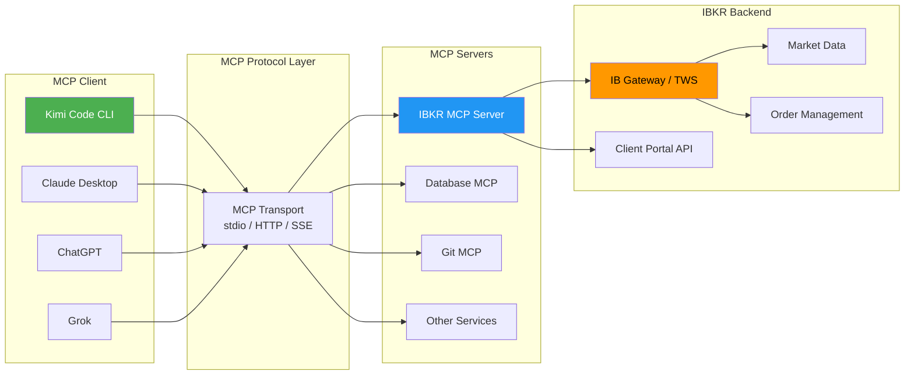
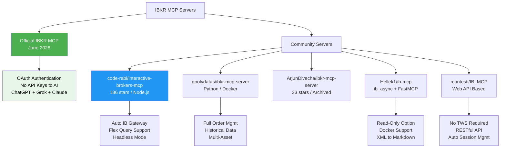
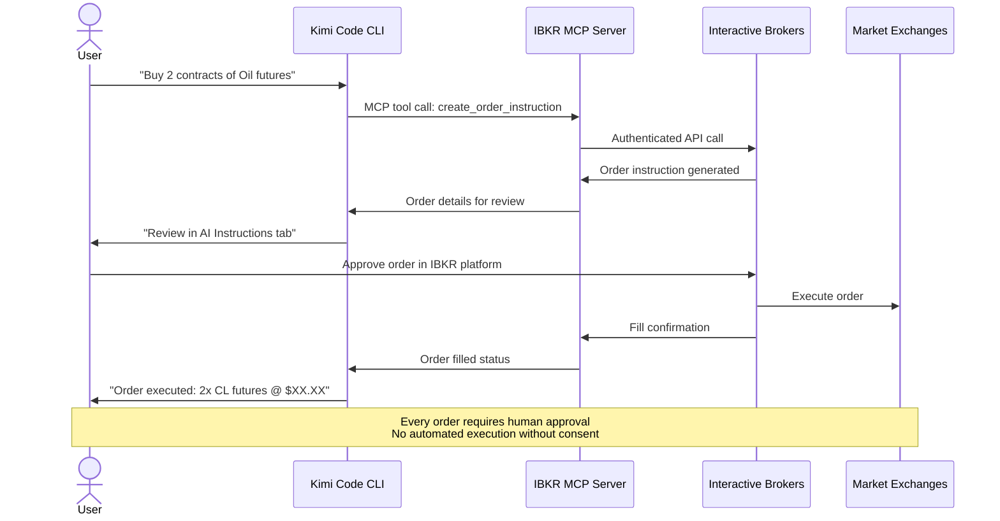
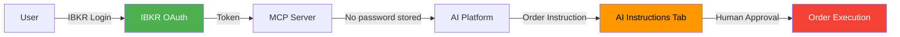
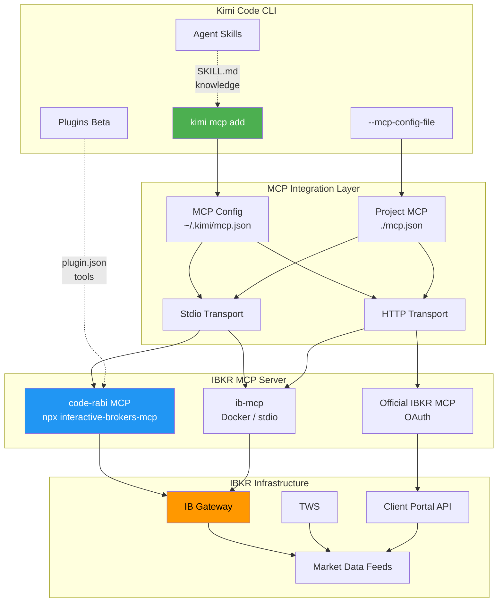
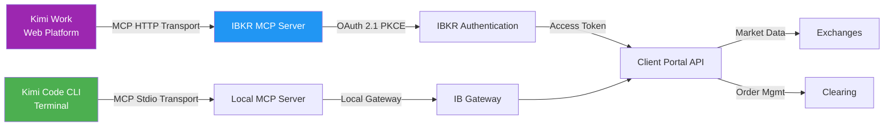
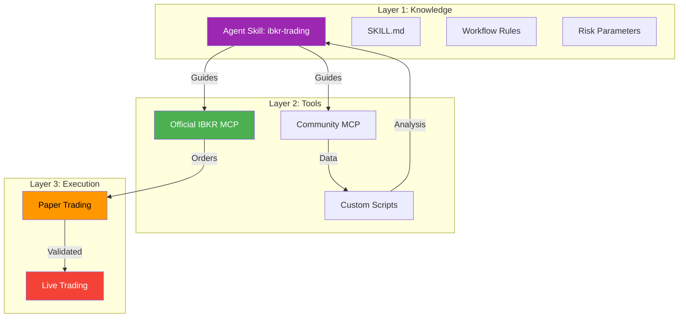
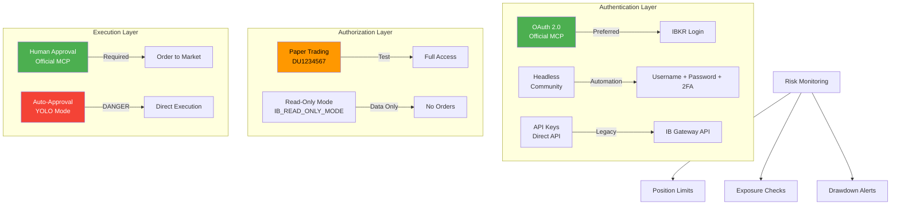
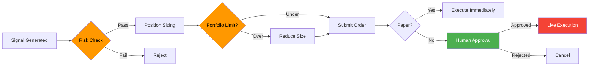

# IBKR x Kimi Integration Blueprint
## MCP-Powered Trading Automation for Kimi Code CLI & Kimi Work

**Document Version:** 1.0
**Date:** 2026-06-28
**Author:** AI Research Assistant
**Status:** Actionable — Ready for Implementation

---

## Table of Contents

1. [Executive Summary](#1-executive-summary)
2. [What Is MCP and Why It Matters](#2-what-is-mcp-and-why-it-matters)
3. [IBKR MCP Ecosystem Landscape](#3-ibkr-mcp-ecosystem-landscape)
4. [Official IBKR MCP (June 2026 Release)](#4-official-ibkr-mcp-june-2026-release)
5. [Community MCP Servers](#5-community-mcp-servers)
6. [Kimi Code CLI Integration Architecture](#6-kimi-code-cli-integration-architecture)
7. [Kimi Work Integration Path](#7-kimi-work-integration-path)
8. [Recommended Implementation: Hybrid Approach](#8-recommended-implementation-hybrid-approach)
9. [Script Library: Pre-Built Commands](#9-script-library-pre-built-commands)
10. [Building a Kimi Plugin for IBKR](#10-building-a-kimi-plugin-for-ibkr)
11. [Creating a Kimi Agent Skill for IBKR](#11-creating-a-kimi-agent-skill-for-ibkr)
12. [Security & Risk Framework](#12-security--risk-framework)
13. [Configuration Reference](#13-configuration-reference)
14. [Action Plan: 48-Hour Sprint](#14-action-plan-48-hour-sprint)
15. [Appendix: API Endpoint Mapping](#15-appendix-api-endpoint-mapping)

---

## 1. Executive Summary

Interactive Brokers (IBKR) now officially supports the Model Context Protocol (MCP) as of June 22, 2026, with native connectors for ChatGPT, Grok, and Claude. **Kimi Code CLI fully supports MCP**, which means we can connect IBKR directly to Kimi's ecosystem today — no middleware required.

This document provides a complete blueprint for integrating IBKR with Kimi Code CLI and Kimi Work using MCP servers, custom plugins, and Agent Skills. It covers both **official IBKR MCP** (recommended for production) and **community MCP servers** (for advanced customization), with ready-to-use scripts for market data, order placement, portfolio management, and authentication.

### Key Findings

| Finding | Detail |
|---------|--------|
| **Official IBKR MCP** | Launched June 2026 — supports ChatGPT, Grok, Claude. Built on MCP standard. OAuth authentication. No API keys shared with AI providers. |
| **Kimi MCP Support** | Kimi Code CLI supports MCP via `kimi mcp add` command. Supports stdio, HTTP, and SSE transports. |
| **Community Options** | 5+ open-source MCP servers available (Node.js and Python). Most feature-complete: `interactive-brokers-mcp` by code-rabi (186 stars). |
| **Plugin System** | Kimi Code CLI has a Beta plugin system with `plugin.json` manifest for executable tools. |
| **Agent Skills** | Kimi supports `SKILL.md` format for knowledge-based workflows — compatible with Claude/Codex skills. |
| **Grok Connector** | IBKR has an official Grok connector (launched June 2026) via xAI's platform. |
| **Asset Classes** | Equities, ETFs, Options, Futures, Futures Options supported via official MCP. |

### Recommendation

**Use the official IBKR MCP server** (via `npx interactive-brokers-mcp`) connected to Kimi Code CLI through the MCP configuration. Supplement with a custom Kimi Agent Skill (`SKILL.md`) for trading workflow knowledge and a Plugin for project-specific scripting.

---

## 2. What Is MCP and Why It Matters

The Model Context Protocol (MCP) is an open standard that allows AI assistants to securely interact with external tools and data sources. Instead of writing custom integrations, MCP provides a universal "USB-C for AI" — any MCP-compatible client (Kimi, Claude, ChatGPT, Grok) can connect to any MCP server (IBKR, databases, APIs).

### How MCP Works



### MCP Transport Methods

| Transport | Use Case | Kimi Support |
|-----------|----------|--------------|
| **stdio** | Local command execution | Yes — `kimi mcp add --transport stdio` |
| **HTTP** | Remote/network services | Yes — `kimi mcp add --transport http` |
| **SSE** | Legacy streaming | Yes — `kimi mcp add --transport sse` |

---

## 3. IBKR MCP Ecosystem Landscape

Multiple MCP server implementations exist for IBKR. Here is the comparison:



### Server Comparison Matrix

| Feature | Official IBKR MCP | code-rabi (Node) | gpolydatas (Py) | Hellek1 (ib-mcp) | IB_MCP (Web) |
|---------|-------------------|------------------|-----------------|-------------------|--------------|
| **Official** | Yes | No (community) | No | No | No |
| **Authentication** | OAuth (IB login) | OAuth + Headless | TWS/Gateway | TWS/Gateway | Web OAuth |
| **Order Placement** | Instruction-based | Direct orders | Direct orders | Read-only mode | Read-only |
| **Market Data** | Quotes, Options | Real-time + Flex | Real-time | Real-time + Historical | Portfolio focus |
| **Options Support** | Yes (new) | Yes | Yes | Yes | Limited |
| **Futures Support** | Yes (new) | No | Yes | Yes | No |
| **Flex Queries** | No | Yes | No | No | No |
| **Auto Gateway** | N/A (cloud) | Yes (bundled) | No | Docker | Docker |
| **Kimi Compatible** | Via MCP std | Via MCP std | Via MCP std | Via MCP std | Via HTTP |
| **Stars** | N/A (official) | 186 | 15+ | 50+ | 30+ |

---

## 4. Official IBKR MCP (June 2026 Release)

On June 22, 2026, IBKR launched its official MCP server with support for ChatGPT, Grok, and Claude. This is the **most secure and future-proof** option.

### How Official IBKR MCP Works



### Official MCP Capabilities

| Capability | Status | Detail |
|------------|--------|--------|
| **Portfolio Analysis** | Available | Positions, P&L, cash balances, margin |
| **Market Data** | Available | Real-time quotes, options chains |
| **Order Instructions** | Available | Generates instructions for user approval |
| **Options Strategies** | Available | Multi-leg options, protective puts, covered calls |
| **Futures** | Available | Recently added (June 2026) |
| **Futures Options** | Available | Recently added (June 2026) |
| **Technical Indicators** | Available | RSI, momentum, volatility analysis |
| **Currency Impact** | Available | FX exposure analysis |
| **Natural Language** | Available | "Which positions have RSI above 70?" |

### Security Model (Official)



**Key security features:**
- OAuth authentication — IBKR credentials never shared with AI provider
- Human-in-the-loop — every order requires explicit approval in IBKR's AI Instructions tab
- No API keys required — uses IBKR's native OAuth flow
- Paper trading support — test without risk

---

## 5. Community MCP Servers

For advanced use cases (direct API access, Flex Queries, custom workflows), community servers provide more control.

### Recommended: code-rabi/interactive-brokers-mcp

The most feature-complete community server (186 GitHub stars).

#### Available Tools

| Tool | Description | Risk Level |
|------|-------------|------------|
| `get_account_info` | Account balances and info | Read-only |
| `get_positions` | Current positions and P&L | Read-only |
| `get_market_data` | Real-time market data | Read-only |
| `place_order` | Place market/limit/stop orders | **Write** |
| `get_order_status` | Check order status | Read-only |
| `get_live_orders` | Monitor open orders | Read-only |
| `get_flex_query` | Execute Flex Queries | Read-only |
| `list_flex_queries` | List saved queries | Read-only |
| `forget_flex_query` | Remove saved query | Admin |

#### Quick Start for Kimi Code CLI

```json
{
  "mcpServers": {
    "interactive-brokers": {
      "command": "npx",
      "args": ["-y", "interactive-brokers-mcp"],
      "env": {
        "IBCP_PAPER_TRADING": "paper"
      }
    }
  }
}
```

#### Headless Mode (for automation)

```json
{
  "mcpServers": {
    "interactive-brokers": {
      "command": "npx",
      "args": ["-y", "interactive-brokers-mcp"],
      "env": {
        "IB_HEADLESS_MODE": "true",
        "IB_USERNAME": "your_ib_username",
        "IB_PASSWORD_AUTH": "your_ib_password",
        "IBCP_PAPER_TRADING": "paper",
        "IB_READ_ONLY_MODE": "true"
      }
    }
  }
}
```

---

## 6. Kimi Code CLI Integration Architecture

Kimi Code CLI integrates with MCP servers through multiple pathways:



### Integration Pathways

| Pathway | Method | Best For |
|---------|--------|----------|
| **MCP Config File** | `kimi --mcp-config-file ./ibkr-mcp.json` | Project-specific trading setups |
| **Global MCP Add** | `kimi mcp add --transport stdio ibkr npx -y interactive-brokers-mcp` | Permanent installation |
| **Plugin System** | `kimi plugin install ./ibkr-plugin/` | Team-shared toolkits |
| **Agent Skill** | `~/.config/agents/skills/ibkr-trading/SKILL.md` | Workflow knowledge |

---

## 7. Kimi Work Integration Path

Kimi Work (the web-based platform) has different integration characteristics compared to Kimi Code CLI:



### Kimi Work Specifics

| Aspect | Kimi Code CLI | Kimi Work |
|--------|---------------|-----------|
| MCP Transport | stdio, HTTP, SSE | HTTP only |
| Authentication | Local env vars | OAuth 2.1 PKCE |
| Session Persistence | Local files | Cloud synced |
| Plugin Support | Yes (Beta) | No |
| Agent Skills | Yes | Yes (via cloud) |
| Best Use Case | Dev/automation | Analysis/research |

### Connecting IBKR MCP to Kimi Work

Since Kimi Work supports MCP over HTTP, you need an HTTP-accessible MCP server:

**Option A: Official IBKR MCP** (if/when available for Kimi)
- IBKR's official MCP is designed for ChatGPT, Grok, Claude
- May require Kimi to be added as a certified connector marketplace partner

**Option B: Self-hosted HTTP MCP Server**
```bash
# Run ib-mcp in HTTP mode
docker run -d \
  --name ibkr-mcp \
  -e IB_HOST=host.docker.internal \
  -e IB_PORT=4001 \
  -e IB_MCP_TRANSPORT=http \
  -e IB_MCP_HTTP_PORT=8000 \
  -p 8000:8000 \
  ghcr.io/hellek1/ib-mcp:latest
```

Then configure Kimi Work to connect to `http://localhost:8000/mcp/`.

---

## 8. Recommended Implementation: Hybrid Approach

For maximum capability and flexibility, implement a three-layer architecture:



### Three-Layer Stack

| Layer | Component | Purpose |
|-------|-----------|---------|
| **Knowledge** | `ibkr-trading` Agent Skill | Trading workflows, risk rules, conventions |
| **Tools** | Official IBKR MCP + code-rabi MCP | Market data, order placement, portfolio |
| **Execution** | IB Gateway (paper first) | Live market connection |

---

## 9. Script Library: Pre-Built Commands

### 9.1 Authentication & Setup

```bash
# --- Check IBKR MCP server health ---
curl -s http://localhost:5000/v1/api/sso/validate | jq

# --- Test Kimi MCP connection ---
kimi mcp list

# --- Add IBKR MCP to Kimi (stdio mode) ---
kimi mcp add --transport stdio ibkr npx -y interactive-brokers-mcp

# --- Add with paper trading ---
kimi mcp add --transport stdio ibkr-paper \
  --env IBCP_PAPER_TRADING=paper \
  --env IB_HEADLESS_MODE=true \
  --env IB_USERNAME=$IB_USER \
  --env IB_PASSWORD_AUTH=$IB_PASS \
  npx -y interactive-brokers-mcp

# --- Verify MCP server is connected ---
kimi mcp list
```

### 9.2 Market Data Scripts

```bash
# --- Start Kimi with IBKR MCP config ---
kimi --mcp-config-file ./ibkr-mcp.json

# --- Inside Kimi CLI, query market data ---
# "Get real-time quotes for AAPL, TSLA, NVDA"
# "Show me the options chain for SPY with 30 DTE"
# "What's the implied volatility for QQQ?"
# "Get historical data for ES futures for the past week"
```

### 9.3 Order Management Scripts

```bash
# --- Place order via Kimi natural language ---
# "Place a limit order to buy 100 shares of AAPL at 2% below current price"
# "Sell 50% of my position in TSLA"
# "Create a protective put strategy for my top 5 holdings"
# "Buy 2 contracts of nearby-month Crude Oil futures"

# --- Flex Query for portfolio report ---
# "Run my daily P&L flex query"
# "List all my trades from last month with commissions"
```

### 9.4 MCP Configuration Files

**`ibkr-mcp.json` — Paper Trading Setup:**
```json
{
  "mcpServers": {
    "ibkr-paper": {
      "command": "npx",
      "args": ["-y", "interactive-brokers-mcp"],
      "env": {
        "IBCP_PAPER_TRADING": "paper",
        "IB_HEADLESS_MODE": "true",
        "IB_USERNAME": "",
        "IB_PASSWORD_AUTH": "",
        "IB_READ_ONLY_MODE": "false",
        "IB_FLEX_TOKEN": ""
      }
    }
  }
}
```

**`ibkr-mcp.json` — Read-Only Market Data:**
```json
{
  "mcpServers": {
    "ibkr-readonly": {
      "command": "npx",
      "args": ["-y", "interactive-brokers-mcp"],
      "env": {
        "IBCP_PAPER_TRADING": "paper",
        "IB_HEADLESS_MODE": "true",
        "IB_USERNAME": "",
        "IB_PASSWORD_AUTH": "",
        "IB_READ_ONLY_MODE": "true"
      }
    }
  }
}
```

**`ibkr-mcp.json` — With Flex Queries:**
```json
{
  "mcpServers": {
    "ibkr-full": {
      "command": "npx",
      "args": ["-y", "interactive-brokers-mcp"],
      "env": {
        "IBCP_PAPER_TRADING": "paper",
        "IB_HEADLESS_MODE": "true",
        "IB_USERNAME": "your_username",
        "IB_PASSWORD_AUTH": "your_password",
        "IB_READ_ONLY_MODE": "false",
        "IB_FLEX_TOKEN": "your_flex_token"
      }
    }
  }
}
```

### 9.5 Portfolio Analysis Prompts (for Kimi)

```markdown
## Use these prompts inside Kimi Code CLI after MCP is connected:

"Show me my current portfolio with P&L breakdown"
"Which of my positions have RSI above 70 or below 30?"
"Compare my portfolio's recent momentum against SPY"
"What is my net liquidation value and buying power?"
"Show me currency impact if USD weakens 10% against my foreign exposures"
"Find options strategies to protect gains on my 5 largest positions"
"Summarize all my trades from last month with win rate and commissions"
"What sectors overlap with robotics and automation?"
"Create sell instructions for any holding with 30-day volatility above 60%"
"Draft a limit order to buy 50 shares of AAPL at 2% below current price"
```

---

## 10. Building a Kimi Plugin for IBKR

Kimi Code CLI's Beta plugin system allows packaging executable tools. Here is a complete plugin structure:

### Plugin Directory Structure

```
kimi-ibkr-plugin/
├── kimi.plugin.json          # Plugin manifest
├── config.json               # Credential config
└── scripts/
    ├── get_quote.py          # Market data tool
    ├── get_positions.py      # Portfolio tool
    ├── place_order.py        # Order placement tool
    ├── get_account.py        # Account info tool
    └── flex_query.py         # Flex query tool
```

### Plugin Manifest (`kimi.plugin.json`)

```json
{
  "name": "kimi-ibkr",
  "version": "1.0.0",
  "description": "Interactive Brokers trading toolkit for Kimi Code CLI",
  "interface": {
    "displayName": "IBKR Trading",
    "shortDescription": "Market data, portfolio, and order management via IBKR"
  },
  "skills": "./skills/",
  "sessionStart": {
    "skill": "using-ibkr"
  },
  "mcpServers": {
    "interactive-brokers": {
      "command": "npx",
      "args": ["-y", "interactive-brokers-mcp"],
      "env": {
        "IBCP_PAPER_TRADING": "paper"
      }
    }
  }
}
```

### Sample Tool Script (`scripts/get_quote.py`)

```python
#!/usr/bin/env python3
"""
IBKR Market Data Tool for Kimi Plugin
Retrieves real-time quotes via Client Portal API
"""
import json
import sys
import urllib.request
import ssl
import os

def get_quote(symbol):
    """Get market data for a symbol"""
    base_url = os.getenv("IBKR_BASE_URL", "https://localhost:5000/v1/api")

    # Create SSL context that ignores cert verification (localhost)
    ctx = ssl.create_default_context()
    ctx.check_hostname = False
    ctx.verify_mode = ssl.CERT_NONE

    try:
        # Search for contract
        search_url = f"{base_url}/iserver/secdef/search?symbol={symbol}&secType=STK"
        req = urllib.request.Request(search_url, headers={"Host": "api.ibkr.com"})
        with urllib.request.urlopen(req, context=ctx, timeout=10) as resp:
            contracts = json.loads(resp.read())

        if not contracts:
            return {"error": f"No contract found for {symbol}"}

        conid = contracts[0]["conid"]

        # Get market data snapshot
        md_url = f"{base_url}/iserver/marketdata/snapshot?conids={conid}&fields=31,83,84,85,86,7295,7633,7674,7675"
        req = urllib.request.Request(md_url, headers={"Host": "api.ibkr.com"})
        with urllib.request.urlopen(req, context=ctx, timeout=10) as resp:
            data = json.loads(resp.read())

        return {
            "symbol": symbol,
            "conid": conid,
            "market_data": data
        }

    except Exception as e:
        return {"error": str(e)}

if __name__ == "__main__":
    if len(sys.argv) < 2:
        print(json.dumps({"error": "Usage: get_quote.py <SYMBOL>"}))
        sys.exit(1)

    result = get_quote(sys.argv[1])
    print(json.dumps(result, indent=2))
```

### Tool Definition in Manifest

```json
{
  "tools": [
    {
      "name": "get-quote",
      "description": "Get real-time market data for a stock symbol",
      "command": ["python3", "scripts/get_quote.py"],
      "parameters": {
        "type": "object",
        "properties": {
          "symbol": {
            "type": "string",
            "description": "Stock ticker symbol (e.g., AAPL)"
          }
        },
        "required": ["symbol"]
      }
    },
    {
      "name": "get-positions",
      "description": "Get current IBKR portfolio positions",
      "command": ["python3", "scripts/get_positions.py"]
    },
    {
      "name": "place-order",
      "description": "Place a market or limit order (paper trading only)",
      "command": ["python3", "scripts/place_order.py"],
      "parameters": {
        "type": "object",
        "properties": {
          "symbol": {"type": "string"},
          "action": {"type": "string", "enum": ["BUY", "SELL"]},
          "quantity": {"type": "integer"},
          "order_type": {"type": "string", "enum": ["MKT", "LMT", "STP"]},
          "limit_price": {"type": "number"}
        },
        "required": ["symbol", "action", "quantity", "order_type"]
      }
    }
  ]
}
```

### Installation

```bash
# Install the plugin
kimi plugin install /path/to/kimi-ibkr-plugin

# Or from Git
kimi plugin install https://github.com/youruser/kimi-ibkr-plugin.git

# Verify
kimi plugin list
kimi plugin info kimi-ibkr
```

---

## 11. Creating a Kimi Agent Skill for IBKR

Agent Skills provide knowledge-based guidance through `SKILL.md` files. This is the recommended starting point for IBKR integration.

### Skill Directory Structure

```
~/.config/agents/skills/
└── ibkr-trading/
    ├── SKILL.md              # Main skill file
    ├── references/
    │   ├── order-types.md    # Order type reference
    │   └── risk-params.md    # Risk management rules
    └── scripts/
        └── orb-strategy.py   # Strategy implementations
```

### SKILL.md — IBKR Trading Skill

```markdown
---
name: ibkr-trading
description: Interactive Brokers trading workflows, market data access, order placement, and risk management through MCP integration
compatibility: Requires Kimi Code CLI with MCP support and IBKR MCP server configured
---

## IBKR Trading Workflows

### Pre-Trade Checklist
1. Verify connection to IBKR MCP: `kimi mcp list`
2. Confirm paper trading mode is active (env: `IBCP_PAPER_TRADING=paper`)
3. Check account balance and buying power
4. Verify market data subscriptions are active
5. Review position sizing against risk limits

### Market Data Workflow
1. Search contract by symbol: `get_market_data` tool
2. Verify contract details (exchange, currency, lot size)
3. Request snapshot or streaming data
4. Check for market data permissions if no data returned

### Order Placement Workflow
1. **ALWAYS** use paper trading for testing
2. Preview order before submission (if available)
3. Use limit orders instead of market orders when possible
4. Set appropriate time-in-force (DAY, GTC, IOC)
5. Verify order in `get_live_orders` after placement
6. Monitor fills via `get_order_status`

### Risk Management Rules
- Maximum single position: 10% of portfolio
- Maximum sector exposure: 30% of portfolio
- Always use stop-losses for leveraged positions
- No trades in last 30 minutes of session without approval
- Paper trade all new strategies for minimum 2 weeks

### Supported Order Types
| Type | Code | Use Case |
|------|------|----------|
| Market | MKT | Immediate execution |
| Limit | LMT | Price-specific entry/exit |
| Stop | STP | Breakout/down entry |
| Stop Limit | STP LMT | Controlled stop execution |

### Flex Query Workflow
1. Configure `IB_FLEX_TOKEN` environment variable
2. Execute query: `get_flex_query` with query ID
3. Queries auto-save on first execution
4. Reuse by name or ID: `get_flex_query("Daily P&L")`
5. Clean up unused queries: `forget_flex_query`

### Session Management
- IB Gateway sessions timeout after ~6 minutes of inactivity
- MCP server auto-reconnects on Gateway restart
- Use `IB_FORCE_STANDALONE_GATEWAY=true` for dedicated gateway
- Session files stored in `ib-gateway/.runtime/`

### Troubleshooting
| Issue | Resolution |
|-------|------------|
| "Cannot connect to IBKR" | Verify TWS/Gateway is running, API enabled |
| "No contract found" | Check symbol spelling, try different exchange |
| "No market data" | Verify market data subscriptions, check market hours |
| "Authentication pending" | Complete 2FA on mobile app, retry |
| "Order rejected" | Check buying power, margin requirements, trading permissions |
```

### Using the Skill

```bash
# Load skill manually
/skill ibkr-trading

# Or set as session-start skill in plugin manifest
# Kimi will automatically reference this skill for trading-related tasks
```

---

## 12. Security & Risk Framework



### Security Best Practices

| Layer | Practice | Implementation |
|-------|----------|----------------|
| **Credentials** | Never hardcode | Use env vars or Kimi credential injection |
| **Network** | Localhost only | Bind to 127.0.0.1, never expose publicly |
| **Trading** | Paper first | `IBCP_PAPER_TRADING=paper` |
| **Orders** | Read-only by default | `IB_READ_ONLY_MODE=true` |
| **2FA** | Always enabled | Mobile app or hardware key |
| **Audit** | Log everything | Enable Flex Query audit trail |
| **Code** | No secrets in git | `.gitignore` all config files |

### Risk Controls



---

## 13. Configuration Reference

### Environment Variables

| Variable | Description | Default | Required |
|----------|-------------|---------|----------|
| `IB_USERNAME` | IBKR account username | - | Headless mode |
| `IB_PASSWORD_AUTH` | IBKR account password | - | Headless mode |
| `IB_HEADLESS_MODE` | Skip browser auth | `false` | Optional |
| `IBCP_PAPER_TRADING` | Trading mode | `live` | **Recommended: `paper`** |
| `IB_READ_ONLY_MODE` | Disable order placement | `false` | For analysis only |
| `IB_FLEX_TOKEN` | Flex Web Service token | - | For Flex Queries |
| `IB_AUTH_TIMEOUT` | Auth timeout (ms) | `120000` | Optional |
| `IB_AUTH_WAIT_SECONDS` | 2FA wait time | `60` | Optional |
| `IB_AUTH_POLL_SECONDS` | Poll interval | `5` | Optional |
| `IB_FORCE_STANDALONE_GATEWAY` | Dedicated gateway | `false` | Optional |

### IBKR Client Portal API Ports

| Service | Port | Use Case |
|---------|------|----------|
| IB Gateway (Live/Paper) | 4001 | API-only, recommended |
| TWS Paper Trading | 7497 | With TWS GUI |
| TWS Live Trading | 7496 | With TWS GUI |
| Client Portal Gateway | 5000 | Web API (alternative) |

### Kimi Code CLI MCP Commands

```bash
# List all MCP servers
kimi mcp list

# Add stdio MCP server
kimi mcp add --transport stdio <name> <command> [args...]

# Add HTTP MCP server
kimi mcp add --transport http <name> <url> --header "KEY: value"

# Add with OAuth
kimi mcp add --transport http --auth oauth <name> <url>

# Remove MCP server
kimi mcp remove <name>

# Authenticate MCP server
kimi mcp auth <name>

# Use ad-hoc config file
kimi --mcp-config-file /path/to/config.json
```

---

## 14. Action Plan: 48-Hour Sprint

### Day 1: Foundation (Hours 0–24)

```mermaid
gantt
    title Day 1: Foundation Setup
    dateFormat HH:mm
    axisFormat %H:%M

    section Prerequisites
    IB Account Setup       :a1, 00:00, 2h
    Node.js Install        :a2, 00:00, 30m
    Market Data Subs       :a3, 02:00, 1h

    section MCP Server
    Install code-rabi MCP  :b1, 03:00, 30m
    Configure Paper Trading :b2, 03:30, 1h
    Test Auth (OAuth)      :b3, 04:30, 1h
    Verify Connection      :b4, 05:30, 30m

    section Kimi Integration
    Add MCP to Kimi        :c1, 06:00, 30m
    Test Market Data       :c2, 06:30, 1h
    Test Account Info      :c3, 07:30, 30m

    section Agent Skill
    Create SKILL.md        :d1, 08:00, 2h
    Test Skill Loading     :d2, 10:00, 30m
```



#### Hour 0–2: Prerequisites
- [ ] Confirm IBKR paper trading account is active
- [ ] Verify Node.js 18+ installed: `node --version`
- [ ] Subscribe to US Securities Snapshot and Futures Value Bundle (paper trading)
- [ ] Generate Flex Web Service Token (Account Management → Settings → Reporting → Flex Web Service)

#### Hour 3–5: MCP Server Setup
```bash
# Test npx installation
npx -y interactive-brokers-mcp --help

# Create MCP config directory
mkdir -p ~/.config/kimi

# Create initial config (edit with your credentials)
cat > ~/.config/kimi/ibkr-paper.json << 'EOF'
{
  "mcpServers": {
    "ibkr-paper": {
      "command": "npx",
      "args": ["-y", "interactive-brokers-mcp"],
      "env": {
        "IBCP_PAPER_TRADING": "paper"
      }
    }
  }
}
EOF
```

#### Hour 6–8: Kimi Integration Test
```bash
# Launch Kimi with IBKR MCP
kimi --mcp-config-file ~/.config/kimi/ibkr-paper.json

# Inside Kimi, test:
# "What is my account balance?"
# "Get market data for AAPL"
# "Show my positions"
```

#### Hour 9–11: Agent Skill
```bash
# Create skill directory
mkdir -p ~/.config/agents/skills/ibkr-trading

# Copy SKILL.md (from Section 11)
# Test loading
/skill ibkr-trading
```

### Day 2: Advanced (Hours 24–48)

```mermaid
gantt
    title Day 2: Advanced Implementation
    dateFormat HH:mm
    axisFormat %H:%M

    section Flex Queries
    Configure Flex Token    :e1, 24:00, 30m
    Test Query Execution    :e2, 24:30, 1h
    Save Common Queries     :e3, 25:30, 1h

    section Order Management
    Test Read-Only Mode     :f1, 26:30, 30m
    Paper Order Placement   :f2, 27:00, 2h
    Order Monitoring        :f3, 29:00, 1h

    section Plugin Development
    Create Plugin Scaffold  :g1, 30:00, 2h
    Implement Tools         :g2, 32:00, 4h
    Test Plugin             :g3, 36:00, 2h

    section Validation
    End-to-End Test         :h1, 38:00, 4h
    Document Issues         :h2, 42:00, 2h
    Next Steps Plan         :h3, 44:00, 2h
```

#### Hour 24–26: Flex Queries
```bash
# Add Flex token to config
# Execute first query
# "Run flex query ID 12345"
# "List my saved flex queries"
```

#### Hour 27–30: Order Testing
```bash
# Test order placement workflow in paper
# "Place a market order for 10 shares of AAPL"
# "Check my open orders"
# "Cancel order ID 123"
```

#### Hour 31–42: Plugin Development
- [ ] Create plugin directory structure
- [ ] Write Python tool scripts
- [ ] Create `kimi.plugin.json` manifest
- [ ] Test plugin installation: `kimi plugin install ./kimi-ibkr-plugin`

#### Hour 43–48: Validation & Documentation
- [ ] Full end-to-end workflow test
- [ ] Document any issues
- [ ] Plan production migration (live account)

---

## 15. Appendix: API Endpoint Mapping

### IBKR Client Portal API (REST)

| Endpoint | Method | Purpose |
|----------|--------|---------|
| `/sso/validate` | GET | Check session validity |
| `/iserver/accounts` | GET | List brokerage accounts |
| `/iserver/account` | POST | Switch active account |
| `/iserver/account/summary` | GET | Account balances |
| `/portfolio/{accountId}/positions` | GET | Current positions |
| `/portfolio/{accountId}/ledger` | GET | Currency balances |
| `/iserver/secdef/search` | GET | Search by symbol |
| `/iserver/secdef/info` | GET | Contract details |
| `/iserver/marketdata/snapshot` | GET | Real-time quotes |
| `/iserver/marketdata/history` | GET | Historical bars |
| `/iserver/account/orders` | GET | Order history |
| `/iserver/account/mma` | GET | P&L summary |
| `/trsrv/futures` | GET | Futures contracts |
| `/trsrv/secdef/schedule` | GET | Trading schedule |

### MCP Tool to API Mapping

| MCP Tool | API Endpoint | Parameters |
|----------|--------------|------------|
| `get_account_info` | `/iserver/account/summary` | None |
| `get_positions` | `/portfolio/{id}/positions` | accountId |
| `get_market_data` | `/iserver/marketdata/snapshot` | conids, fields |
| `place_order` | `/iserver/account/{id}/orders` | orders[] |
| `get_order_status` | `/iserver/account/orders/{id}` | orderId |
| `get_live_orders` | `/iserver/account/orders` | filters |
| `get_flex_query` | Flex Web Service | queryId |

---

## References & Resources

### Official Documentation
- [Interactive Brokers AI Integrations](https://www.interactivebrokers.com/en/trading/ai-integrations.php)
- [IBKR API Campus](https://www.interactivebrokers.com/campus/ibkr-api-page/)
- [Client Portal API Reference](https://www.interactivebrokers.com/campus/ibkr-api-page/cpapi-v1/)
- [Web API Trading Reference](https://www.interactivebrokers.com/campus/ibkr-api-page/web-api-trading/)

### Kimi Documentation
- [Kimi Code CLI Docs](https://www.kimi.com/code/docs/en/kimi-code-cli/)
- [Agent Skills Guide](https://moonshotai.github.io/kimi-cli/en/customization/skills.html)
- [Plugins Beta Docs](https://moonshotai.github.io/kimi-cli/en/customization/plugins.html)
- [MCP Integration](https://moonshotai.github.io/kimi-cli/en/customization/mcp.html)

### MCP Servers (GitHub)
- [code-rabi/interactive-brokers-mcp](https://github.com/code-rabi/interactive-brokers-mcp) — 186 stars, Node.js
- [Hellek1/ib-mcp](https://github.com/Hellek1/ib-mcp) — ib_async + FastMCP
- [gpolydatas/ibkr-mcp-server](https://github.com/gpolydatas/ibkr-mcp-server) — Python
- [rcontesti/IB_MCP](https://github.com/rcontesti/IB_MCP) — Web API based

### News & Announcements
- [IBKR Expands AI Suite with ChatGPT and Grok](https://worldbusinessoutlook.com/interactive-brokers-expands-ai-trading-suite-with-chatgpt-and-grok/) — June 2026
- [IBKR Official Press Release](https://www.interactivebrokers.com/en/general/about/mediaRelations/6-22-26.php) — June 22, 2026

---

*This document is generated for research and educational purposes. Trading involves substantial risk of loss. Always test with paper trading first. No warranty provided. Use at your own risk.*
