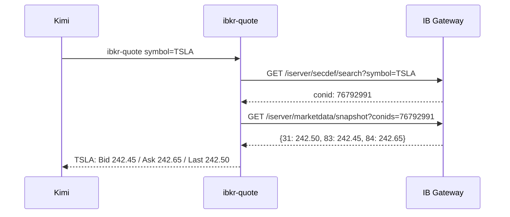
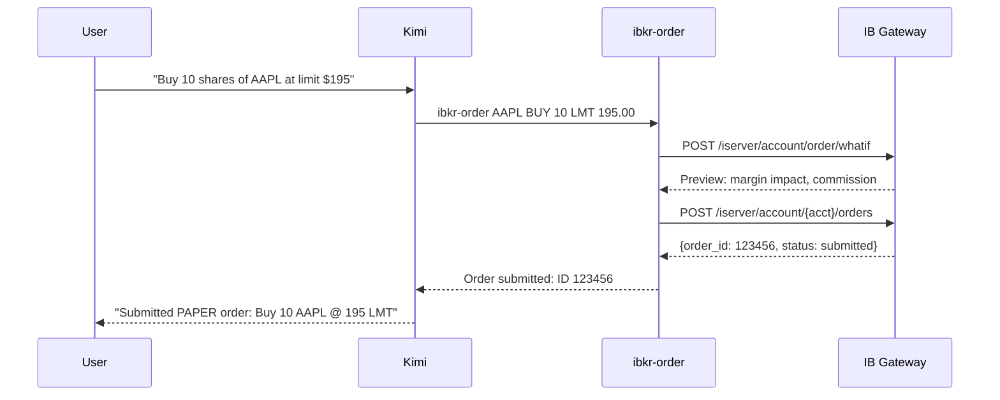
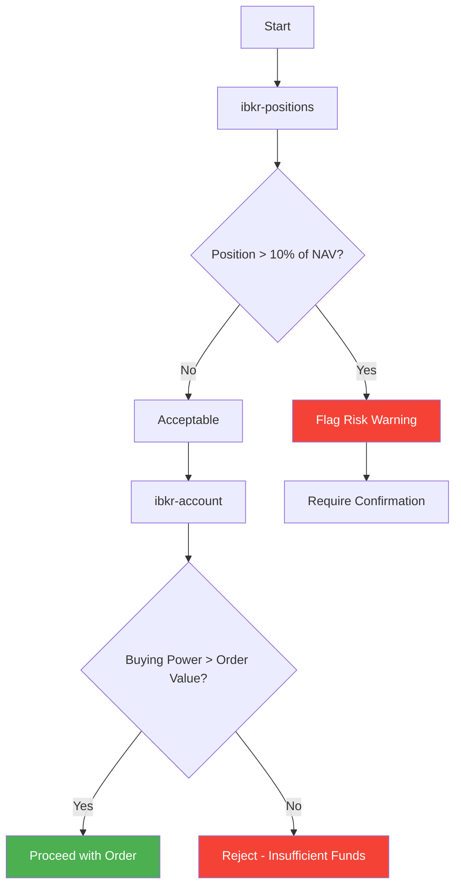
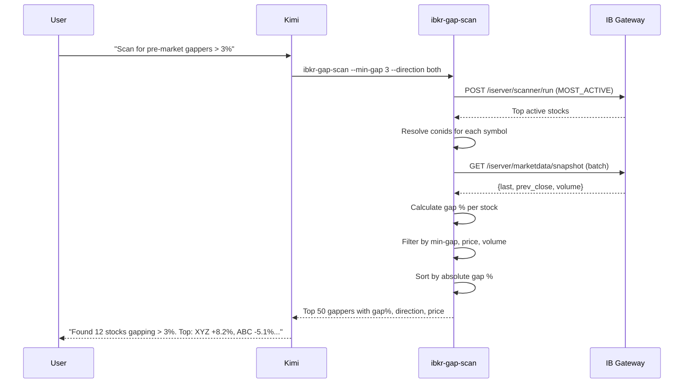
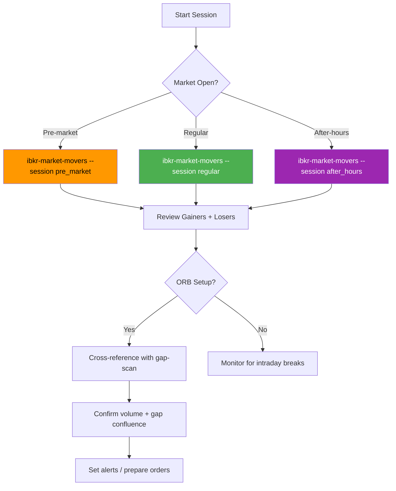
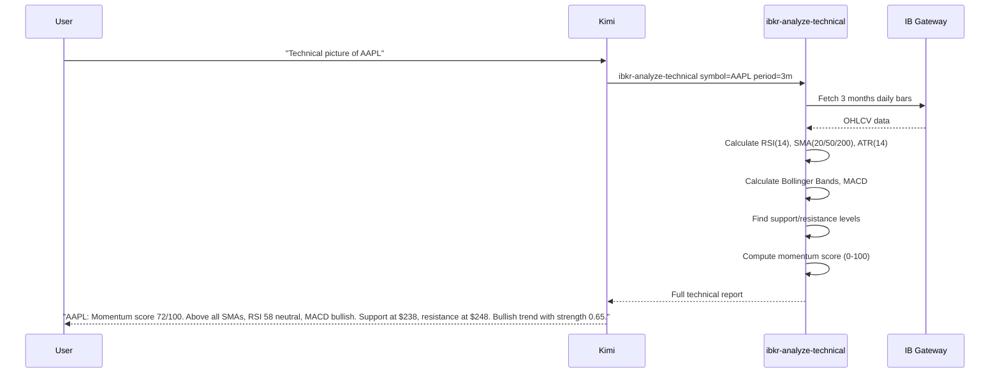
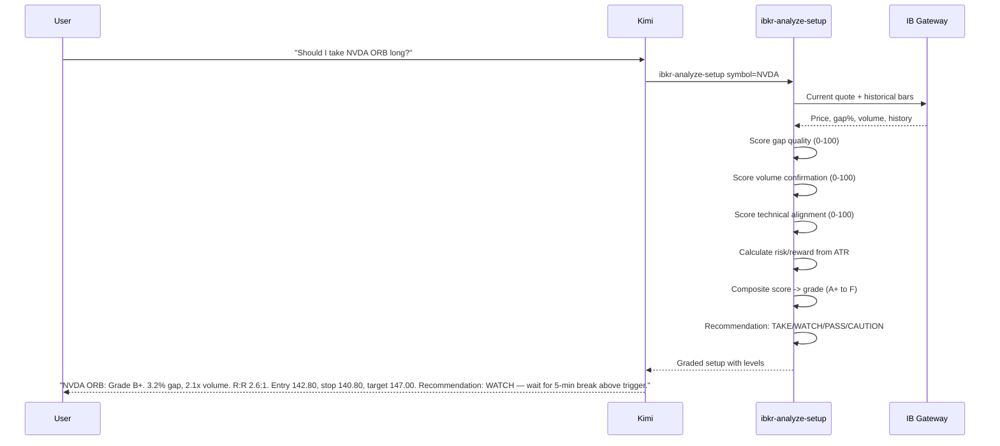
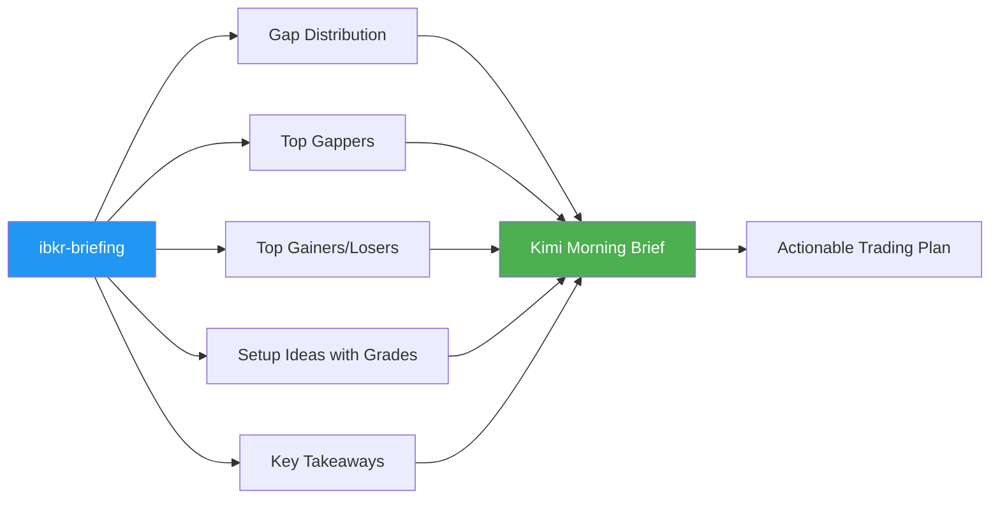
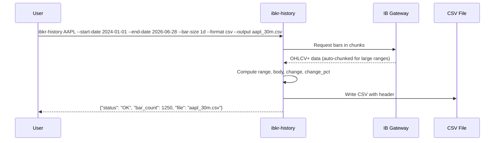

# IBKR Local Gateway Trading

Trading workflows for Interactive Brokers via local IB Gateway using the `ibkr-tools` plugin.

## Architecture


## Pre-Flight Checklist

Before any trading operation, run `ibkr-status` to verify:

1. IB Gateway is running and logged in
2. API connections are enabled (Settings > API > Enable)
3. Port matches configuration (default: 4004, set via IB_GATEWAY_PORT env var)
4. Session is authenticated
5. Market data subscriptions are active

## Tool Reference

| Tool | Purpose | Example |
|------|---------|---------|
| `ibkr-status` | Check Gateway connection | `ibkr-status` |
| `ibkr-quote` | Real-time quote | `ibkr-quote symbol=AAPL` |
| `ibkr-search` | Contract lookup | `ibkr-search symbol=ES` |
| `ibkr-positions` | Portfolio positions | `ibkr-positions` |
| `ibkr-account` | Account balances | `ibkr-account` |
| `ibkr-orders` | Open orders | `ibkr-orders` |
| `ibkr-order` | Place order | `ibkr-order symbol=AAPL action=BUY qty=10 type=LMT price=150` |
| `ibkr-cancel-order` | Cancel order | `ibkr-cancel-order order_id=123456` |
| `ibkr-history` | Historical OHLCV+ data download | `ibkr-history AAPL --start-date 2026-01-01 --format csv --output aapl.csv` |
| `ibkr-pnl` | P&L summary | `ibkr-pnl` |
| `ibkr-gap-scan` | Pre-market gap scanner | `ibkr-gap-scan --min-gap 3 --direction up --universe nasdaq100` |
| `ibkr-market-movers` | Gainers/losers/most active | `ibkr-market-movers --type gainers --count 10 --session pre_market` |
| `ibkr-analyze-technical` | Technical analysis (RSI, SMA, ATR, MACD, BB) | `ibkr-analyze-technical AAPL --period 3m` |
| `ibkr-analyze-setup` | ORB setup evaluator (grades A-F) | `ibkr-analyze-setup NVDA --direction long` |
| `ibkr-analyze-finnhub` | News, earnings, sentiment, analysts | `ibkr-analyze-finnhub TSLA` |
| `ibkr-briefing` | Full pre-market briefing | `ibkr-briefing --universe nasdaq100 --gap-min 3` |

## Workflow Patterns

### Market Data Request



### Order Placement (Paper Trading)



### Position and Risk Check



### Pre-Market Gap Scan Workflow



### Gap Scan Parameter Guide

| Parameter | Typical Values | When to Use |
|-----------|---------------|-------------|
| `--min-gap` | 2.0, 3.0, 5.0, 10.0 | Higher = fewer but stronger signals |
| `--max-gap` | 20.0, 30.0, 50.0 | Cap to avoid low-float parabolics |
| `--direction` | up, down, both | Momentum plays = up; mean reversion = down |
| `--min-price` | 1.0, 5.0, 10.0 | Avoid sub-$5 penny stocks |
| `--max-price` | 100, 200, 500 | Focus on affordable position sizes |
| `--min-volume` | 100, 500, 1000 | Ensure liquidity (in thousands) |
| `--universe` | nasdaq100, most_active | NQ100 for quality; most_active for breadth |
| `--max-results` | 10, 20, 50 | Manageable watchlist size |
| `--sort-by` | gap, volume, price | Gap = momentum; Volume = confirmation |

### ORB Strategy Gap Scan Presets

| Strategy | Command |
|----------|---------|
| **Conservative gap-up** | `ibkr-gap-scan --min-gap 2 --max-gap 10 --direction up --min-price 10 --min-volume 500 --universe nasdaq100 --max-results 20` |
| **Aggressive gap-up** | `ibkr-gap-scan --min-gap 5 --direction up --min-price 5 --min-volume 100 --universe most_active --max-results 50` |
| **Gap-down reversal** | `ibkr-gap-scan --min-gap 3 --direction down --min-price 15 --min-volume 300 --sort-by volume` |
| **Pre-market momentum** | `ibkr-gap-scan --min-gap 4 --direction both --min-price 10 --min-volume 1000 --universe most_active --detailed` |

### Market Movers Workflow



### Market Movers Presets

| Scenario | Command |
|----------|---------|
| **Pre-market leaders** | `ibkr-market-movers --type gainers --count 15 --session pre_market --min-volume 100` |
| **Regular hours top gainers** | `ibkr-market-movers --type gainers --count 20 --exchange nasdaq` |
| **Short squeeze scan** | `ibkr-market-movers --type gainers --count 10 --min-volume 500 --detailed` |
| **End-of-day washouts** | `ibkr-market-movers --type losers --count 10 --session after_hours` |
| **Full market picture** | `ibkr-market-movers --type all --count 10 --detailed` |

## AI Analysis Workflows

### Technical Analysis Workflow



**When Kimi receives the technical report, it should interpret:**
- Momentum score > 70 = bullish, < 30 = bearish, 30-70 = neutral
- RSI > 70 = overbought caution, < 30 = oversold opportunity
- Price above SMA20 + SMA50 = trend aligned for longs
- MACD histogram positive = momentum supporting longs
- ATR% > 5% = volatile stock, wider stops needed

### Setup Evaluation Workflow



**Grade interpretation:**
| Grade | Score | Action |
|-------|-------|--------|
| A+ / A / A- | 82-100 | TAKE — strong edge, favorable conditions |
| B+ / B / B- | 62-81 | WATCH — decent, needs confirmation |
| C+ / C / C- | 42-61 | CAUTION — marginal, paper trade only |
| D / F | 0-41 | PASS — avoid |

### Research Workflow ("Why is it moving?")

```mermaid
flowchart TD
    A[User asks: "Why is TSLA moving?"] --> B[ibkr-analyze-technical]
    A --> C[ibkr-analyze-finnhub]
    A --> D[Kimi web search]

    B -->|Price action context| E[Kimi Synthesis]
    C -->|News + earnings + sentiment| E
    D -->|Web articles + SEC filings| E

    E --> F[Concise answer with confidence level]

    style D fill:#9C27B0,color:#fff
    style E fill:#4CAF50,color:#fff
```

**How Kimi should use the data:**
1. Run `ibkr-analyze-technical` — get gap%, volume, trend context
2. Run `ibkr-analyze-finnhub` — get news headlines with sentiment, earnings proximity
3. Use Kimi's built-in web search for broader context
4. Synthesize: "TSLA gapping +3.5% on delivery beat (Reuters positive). RSI 54, not overbought. Above all SMAs. Next earnings in 24 days. Bullish catalyst with technical alignment."

### Pre-Market Briefing Workflow



**The briefing output includes:**
- How many stocks gapping up vs down (market bias)
- Top 10 gappers with gap% and direction
- Top 10 gainers and losers
- Up to 5 setup ideas with entry/stop/target/grade
- Key takeaways (automated insights)

### Finnhub Integration Guide

To enable news, earnings, and analyst data:

```bash
# 1. Get free API key at https://finnhub.io/register
# 2. Export in your shell profile:
export FINNHUB_API_KEY=your_key_here
```

**Without Finnhub:** Technical analysis and setup grading work fully. News/earnings columns will show "not available."

**With Finnhub:** Full enrichment — sentiment scoring on headlines, earnings proximity warnings, analyst consensus, price targets.

### Historical Data Export for Backtesting



**CSV columns:** `timestamp, open, high, low, close, volume, range, body, range_pct, change, change_pct`

**For backtest tools:** The CSV is pandas-compatible. Read with `pd.read_csv("aapl_30m.csv")` — no parsing needed.

**Default behavior:** If no dates specified, downloads last 3 months of daily bars.

## Risk Management Rules

### Hard Limits (Never Override Without Explicit User Confirmation)

- **Max Position Size**: No single position > 10% of net liquidation value
- **Max Sector Exposure**: No sector > 30% of portfolio
- **Cash Reserve**: Maintain minimum 20% cash or short-term equivalents
- **Order Validation**: Always preview order before submission to check margin impact

### Order Type Guidelines

| Scenario | Recommended Type | Reason |
|----------|-----------------|--------|
| Quick entry/exit on momentum | MKT | Speed matters |
| Specific price entry | LMT | Control fill price |
| Breakout entry | STP | Auto-trigger on move |
| Profit target | LMT GTC | Set and forget |
| Loss protection | STP | Automated stop |

### Paper Trading Requirement

All new strategies and tools MUST be validated in paper trading mode first:

```bash
# Set in environment or plugin config
export IB_PAPER_TRADING=true
```

The `ibkr-order` tool enforces preview-before-submit and displays PAPER/LIVE mode in every response.

## IB Gateway Configuration

### Required Settings

1. **Enable API**: Edit > Settings > API > Enable "ActiveX and Socket Clients"
2. **Port**: Note the socket port (default 4001 for Gateway, 7496/7497 for TWS)
3. **Localhost Only**: Ensure "Allow connections from localhost only" is checked
4. **Master API Client ID**: Leave as 0 unless using multiple clients

### Session Persistence

- IB Gateway auto-logs out after ~6 minutes of inactivity
- Keep Gateway window active or use auto-restart scripts
- The plugin tools will return clear DISCONNECTED status if session expired

### Environment Variables

| Variable | Default | Purpose |
|----------|---------|---------|
| `IB_GATEWAY_HOST` | `localhost` | Gateway hostname |
| `IB_GATEWAY_PORT` | `4004` | Client Portal API port (your IB Gateway port) |
| `IB_PAPER_TRADING` | `true` | Force paper trading mode |

## Troubleshooting

| Symptom | Cause | Fix |
|---------|-------|-----|
| "Connection failed" | Gateway not running | Start IB Gateway, log in |
| "HTTP 401/403" | Session expired | Re-authenticate in Gateway |
| "No market data" | Missing subscription | Check Market Data Subscriptions in Account Management |
| "Contract not found" | Wrong symbol | Use `ibkr-search` to verify |
| "Order rejected" | Insufficient buying power | Check `ibkr-account` for available funds |
| "Preview failed" | Invalid parameters | Check conid, order type, price format |
| Empty positions list | No holdings | Normal if portfolio is flat |

## Best Practices

1. **Always check status first**: Run `ibkr-status` at session start
2. **Quote before ordering**: Get current market price with `ibkr-quote` before placing orders
3. **Verify fills**: After placing an order, check `ibkr-orders` to confirm status
4. **Monitor P&L**: Run `ibkr-pnl` at end of session for performance tracking
5. **Use limit orders**: Prefer LMT over MKT to control slippage
6. **Log everything**: The plugin outputs structured JSON — redirect to files for audit trail

## Extending the Plugin

To add new capabilities:

1. Create a new Python script in `scripts/` following the `ibkr_core.py` pattern
2. Add the tool definition to `kimi.plugin.json`
3. Follow the request/response format: `{"status": "OK", ...}` or `{"status": "ERROR", ...}`
4. Always validate Gateway connection before API calls
5. Handle SSL context for localhost (self-signed cert)

## Direct API Testing (Outside Kimi)

```bash
# Test Gateway connectivity
curl -k https://localhost:4004/v1/api/sso/validate

# Get account list
curl -k https://localhost:4004/v1/api/iserver/accounts

# Search for AAPL
curl -k 'https://localhost:4004/v1/api/iserver/secdef/search?symbol=AAPL&secType=STK'
```
